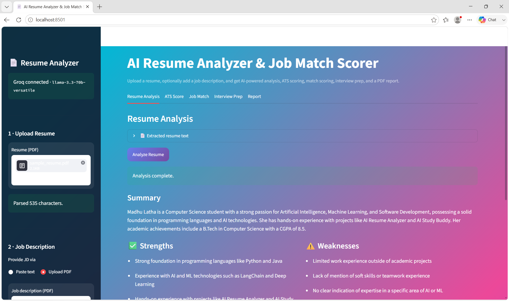
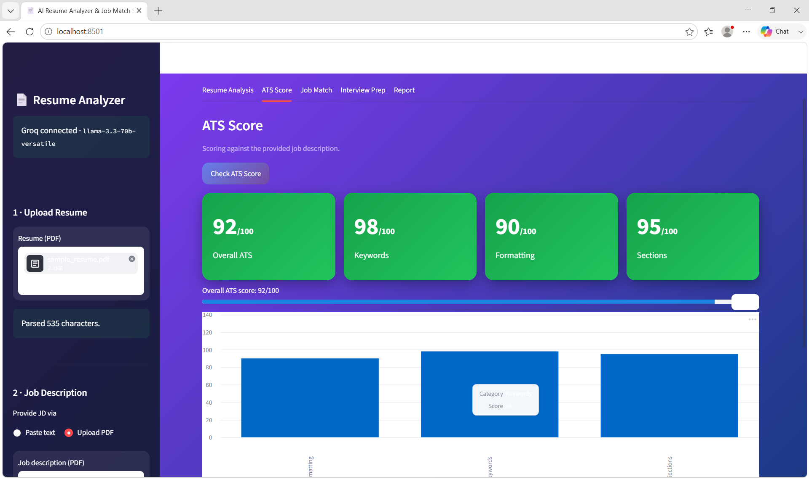
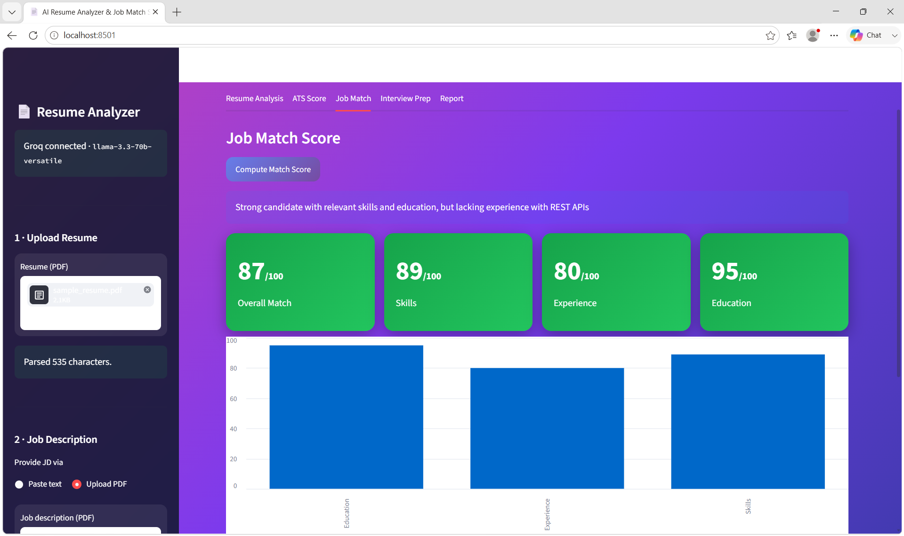
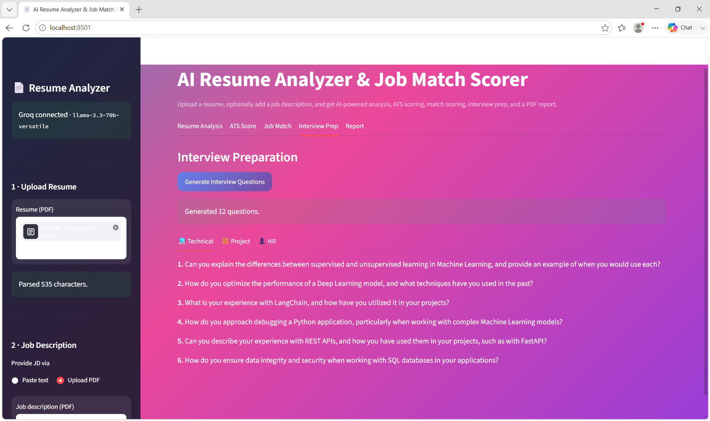
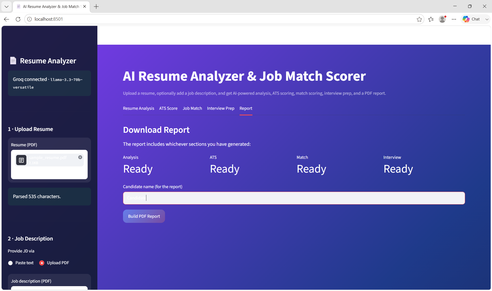

# 📄 AI Resume Analyzer & Job Match Scorer

An AI-powered resume analysis tool built with **Streamlit**, **LangChain**, and the
**Groq** LLM API (`llama-3.3-70b-versatile`). Upload a resume, optionally add a
job description, and get structured analysis, ATS scoring, job-match scoring,
tailored interview questions, and a downloadable PDF report.

---

## ✨ Features

| # | Feature | What it does |
|---|---------|--------------|
| 1 | **Resume Upload** | Upload a PDF, extract & clean the text, preview it. |
| 2 | **Resume Analysis** | Summary, strengths, weaknesses, missing skills, grammar issues, ATS/formatting suggestions, career recommendations. |
| 3 | **Job Description Input** | Paste JD text **or** upload a JD PDF. |
| 4 | **Job Match Score** | Overall + skills/experience/education sub-scores, matched & missing skills, recommendations. |
| 5 | **ATS Score** | Overall ATS score with keyword / formatting / section sub-scores, issues, and fixes. |
| 6 | **Improvement Suggestions** | Stronger summaries, skills, and action-verb-driven bullet points. |
| 7 | **Interview Questions** | ~15 tailored technical, project, and HR questions. |
| 8 | **Download Report** | One-click PDF report bundling every result. |

---

## 🧱 Project Structure

```
ai-resume-analyzer/
├── app.py                  # Streamlit UI (entry point)
├── requirements.txt        # Python dependencies
├── .env.example            # Template for environment variables
├── .env                    # Your local config (add your GROQ_API_KEY)
├── README.md
├── assets/                 # Images / static assets
├── data/                   # Sample resume & job description (+ PDF generator)
├── reports/                # Default output folder for generated reports
├── src/
│   ├── __init__.py
│   ├── prompts.py          # All prompt templates (system + human)
│   ├── utils.py            # Config, Groq LLM client, JSON parsing, errors
│   ├── parser.py           # PDF text extraction + cleaning
│   ├── analyzer.py         # Resume Analysis chain + schema
│   ├── matcher.py          # Job Match chain + schema
│   ├── ats.py              # ATS scoring chain + schema
│   ├── interview.py        # Interview questions chain + schema
│   └── report_generator.py # PDF report builder
└── tests/                  # Pytest unit tests (run fully offline)
```

### How the files connect

```
app.py
  ├─ src/parser.py            -> text from uploaded PDFs
  ├─ src/analyzer.py ─┐
  ├─ src/ats.py       ├─ each builds a prompt (src/prompts.py) and calls
  ├─ src/matcher.py   │   src/utils.run_structured_chain(prompt, Schema, vars)
  ├─ src/interview.py ┘        └─ get_llm() -> ChatGroq, extract_json(), Pydantic
  └─ src/report_generator.py  -> bundles results into a downloadable PDF
```

---

## 🚀 Installation

```bash
# 1. Clone / unzip the project, then:
cd ai-resume-analyzer

# 2. (Recommended) create a virtual environment
python3 -m venv .venv
source .venv/bin/activate        # Windows: .venv\Scripts\activate

# 3. Install dependencies
pip install -r requirements.txt
```

> Requires **Python 3.11+**.

---

## 🔑 Setup — Environment Variables

1. Get a free API key from **<https://console.groq.com/keys>**.
2. Copy the template and add your key:

   ```bash
   cp .env.example .env
   ```

3. Edit `.env`:

   | Variable | Required | Default | Description |
   |----------|----------|---------|-------------|
   | `GROQ_API_KEY` | ✅ | — | Your Groq API key. |
   | `GROQ_MODEL` | ❌ | `llama-3.3-70b-versatile` | Groq chat model. |
   | `GROQ_TEMPERATURE` | ❌ | `0.2` | Sampling temperature. |
   | `GROQ_MAX_RETRIES` | ❌ | `2` | LLM retry attempts. |
   | `GROQ_REQUEST_TIMEOUT` | ❌ | `60` | Per-request timeout (s). |

---

## ▶️ Running the App

```bash
streamlit run app.py
```

Then open the URL Streamlit prints (default <http://localhost:8501>).

**Try it with the sample data:** generate a sample resume PDF and use the
included job description (`data/sample_job_description.txt`):

```bash
python data/generate_sample_pdf.py   # creates data/sample_resume.pdf
```

---

## 🧪 Testing

The test suite runs **fully offline** (no API key needed) — the LLM chains are
tested with a fake model that returns canned JSON.

```bash
pytest -q
```

What's covered:
- `tests/test_parser.py` — PDF extraction + text cleaning.
- `tests/test_utils.py` — JSON extraction, score clamping, settings.
- `tests/test_chains.py` — all four chains (analysis, ATS, match, interview).
- `tests/test_report_generator.py` — PDF report bytes.

### Sample input / expected output

**Input** — `data/sample_resume.txt` (Jane Doe, Python/Flask, 4 yrs) vs.
`data/sample_job_description.txt` (Senior Python, AWS/K8s, 5+ yrs).

**Expected job-match output (illustrative):**

```json
{
  "match_score": 68,
  "skills_match_score": 62,
  "experience_match_score": 60,
  "education_match_score": 90,
  "matched_skills": ["Python", "Docker", "PostgreSQL", "REST APIs"],
  "missing_skills": ["AWS", "Kubernetes", "FastAPI", "CI/CD"],
  "recommendations": [
    "Gain hands-on AWS experience (ECS/EKS, S3, RDS).",
    "Quantify achievements, e.g. 'reduced API latency by 30%'."
  ],
  "verdict": "Solid Python foundation but light on cloud/infra for a senior role."
}
```

---

## 🧠 LangChain & Prompt Design

Each capability is a small chain assembled in `src/utils.run_structured_chain`:

```
ChatPromptTemplate  ->  ChatGroq  ->  StrOutputParser  ->  extract_json  ->  Pydantic model
```

- **System prompts** define the role, constraints, and an exact JSON schema.
- Models are told to **reason internally** (chain of thought) but emit **JSON only**.
- `extract_json` tolerates markdown fences, leading prose, and trailing commas.
- Pydantic schemas validate the output and **clamp scores** to `0–100`.

Chains and their outputs:

| Chain | File | Output schema |
|-------|------|---------------|
| Resume Analysis | `analyzer.py` | summary, strengths, weaknesses, improvements… |
| ATS | `ats.py` | `ats_score`, sub-scores, issues, recommendations |
| Job Matching | `matcher.py` | `match_score`, matched/missing skills, recommendations |
| Interview | `interview.py` | technical / hr / project questions |

---

## 🖼️ Screenshots

### 🏠 Home Page

The main interface where users can upload their resume and provide a job description.



---

### 📄 Resume Analysis

AI-generated resume summary, strengths, weaknesses, missing skills, grammar suggestions, formatting feedback, and career recommendations.



---

### 📊 ATS Score

Detailed ATS compatibility score including keyword matching, formatting score, section analysis, issues detected, and improvement recommendations.



---

### 🎯 Job Match Score

Compares the uploaded resume with the job description and provides an overall match percentage, matched skills, missing skills, and recommendations.



---

### 💼 Interview Questions

Automatically generates personalized technical, HR, and project-based interview questions based on the uploaded resume and job description.



## ☁️ Deployment

### Streamlit Community Cloud
1. Push this project to a GitHub repo.
2. Go to <https://share.streamlit.io>, pick the repo, set the main file to `app.py`.
3. In **Settings → Secrets**, add:
   ```toml
   GROQ_API_KEY = "your_key"
   ```
4. Deploy.

### Render
1. New **Web Service** from your repo.
2. **Build command:** `pip install -r requirements.txt`
3. **Start command:**
   ```bash
   streamlit run app.py --server.port $PORT --server.address 0.0.0.0
   ```
4. Add `GROQ_API_KEY` under **Environment**.

### Railway
1. New project → Deploy from repo.
2. Add `GROQ_API_KEY` variable.
3. Start command:
   ```bash
   streamlit run app.py --server.port $PORT --server.address 0.0.0.0
   ```

### Hugging Face Spaces
1. Create a **Streamlit** Space.
2. Upload the project (or connect the repo). Ensure `app.py` is at the root.
3. Add `GROQ_API_KEY` under **Settings → Variables and secrets**.

---

## 🛡️ Error Handling

The app shows friendly messages for:
- Empty / missing uploads.
- Invalid, scanned, or password-protected PDFs.
- Missing or placeholder `GROQ_API_KEY`.
- LLM failures, timeouts, and malformed responses.

---

## 🔭 Future Improvements

- FAISS-backed semantic skill matching (dependency already included).
- Multi-resume batch comparison and ranking.
- Cover-letter generator chain.
- Caching of LLM responses to cut cost/latency.
- DOCX export in addition to PDF.

---

## 📜 License

MIT — use it freely.
